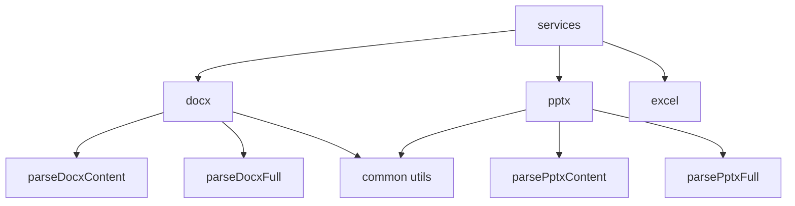
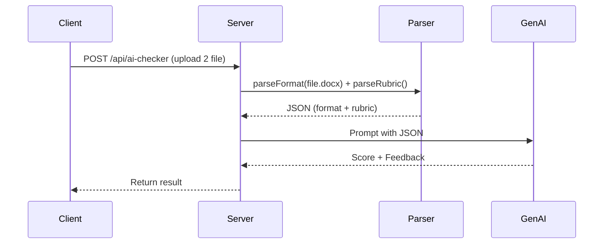

<p align="center">
  
  &nbsp;&nbsp;&nbsp;
  
</p>

<h1 align="center">
  Office Format Grader AI API
</h1>

<p align="center"><strong>Phân tích và chấm điểm file Microsoft Office bằng GenAI • Xây dựng bằng Bun.js + Hono</strong></p>

---

## 🎯 Mục Tiêu Dự Án

API này hỗ trợ:
- Phân tích cấu trúc & định dạng file `.docx`, `.pptx`, `.xlsx`
- Trích xuất nội dung và các thành phần định dạng phức tạp
- Tích hợp với GenAI để **chấm điểm bài tập Word / PowerPoint** theo tiêu chí cho trước

---

## 🛠️ Công Nghệ

| Thành phần     | Công nghệ                       |
|----------------|---------------------------------|
| Runtime        | [**Bun.js**](https://bun.sh)    |
| Framework      | [**Hono**](https://hono.dev)    |
| Ngôn ngữ       | TypeScript                      |
| Parser         | `xlsx`, `adm-zip`, `xml2js`     |
| AI Integration | Gemini 2.5 (qua REST API)       |

---

## 🧱 Kiến Trúc Tổng Quan

```mermaid
graph TD
  A[Client Upload] -->|FormData| B[Hono API]
  B --> C1[GET files]
  B --> C2[GET file details]
  B --> C3[POST ai-checker]
  C1 --> D1[Scan Folder]
  C2 --> D2[Extract Format]
  C3 --> D3[Extract Format + Rubric]
  D3 --> E[GenAI Model]

````
## 📂 Cấu Trúc Thư Mục

```bash
src/
├── api/                 # Các route Hono
├── services/
│   ├── docx/            # Phân tích Word
│   ├── pptx/            # Phân tích PowerPoint
│   ├── excel/           # Phân tích Excel
│   └── ai-checker/      # Kết nối GenAI
├── types/               # Interface TS
├── utils/               # Helper dùng chung
└── server.ts            # Start app
```
---

## 🧩 Phân Rã Module Phân Tích File



---

## 📡 API Endpoints

### 1. `GET /api/files`

Quét thư mục mặc định (`example/`) hoặc custom `?path=`

```json
{
  "success": true,
  "data": [
    { "name": "report.docx", "path": "example/report.docx" }
  ]
}
```

---

### 2. `GET /api/files/details?filename=...&mode=...`

Phân tích file `.docx`, `.pptx`, `.xlsx` với 2 chế độ:

* `mode=content` (nhanh, đơn giản)
* `mode=full` (chi tiết, đầy đủ format)

```json
{
  "filename": "slide.pptx",
  "mode": "full",
  "details": {
    "slideCount": 10,
    "slides": [
      {
        "title": "Giới thiệu",
        "layout": "Title Slide",
        "animations": ["fade", "appear"]
      }
    ]
  }
}
```

---

### 3. `POST /api/ai-checker`

Tự động chấm điểm bằng AI. Upload 2 file (bài nộp + tiêu chí), nhận lại điểm và feedback từ GenAI.

**FormData:**

* `files[] = [bai.docx, tieuchi.docx]`

**Response:**

```json
{
  "success": true,
  "data": {
    "score": 8.5,
    "feedback": "Nội dung tốt, thiếu hiệu ứng.",
    "rubricUsed": "TieuChi.docx",
    "model": "gemini-2.5-flash"
  }
}
```

---

## 🔁 Luồng Xử Lý AI Checker



---

## 🧪 Kiểm Thử

```bash
bun install
bun run start

# Test API
curl http://localhost:3000/api/files
curl -X POST -F "files=@bai.docx" -F "files=@tieuchi.docx" http://localhost:3000/api/ai-checker
```

---

## 📌 Ghi Chú

* 🧠 Stateless → không dùng DB
* 🧠 Phân tích file xong là huỷ, không lưu trữ
* 🧠 Output JSON chuẩn hóa, tương thích AI & FE

---

<p align="center">
  <i>Xây dựng bởi  Bun.js +  Hono</i>
</p>
