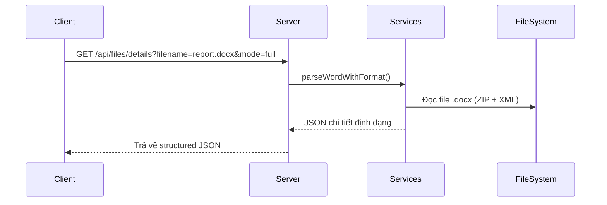

<p align="center">
  
  &nbsp;&nbsp;&nbsp;
  
</p>

<h1 align="center">
  Office Format Analyzer API
</h1>

<p align="center"><strong>Phân tích file Microsoft Office và trả về dữ liệu có cấu trúc JSON</strong></p>

---

## 🎯 Mục Tiêu Dự Án

API cho phép bạn:

- Quét thư mục và phát hiện file `.docx`, `.pptx`, `.xlsx`
- Trích xuất nội dung thô hoặc cấu trúc định dạng phức tạp
- Đặc biệt: phân tích sâu **format văn bản Word** và **slide PowerPoint**, hỗ trợ bảng, ảnh, hiệu ứng, layout và nhiều thuộc tính trình bày khác

---

## 🛠️ Công Nghệ Sử Dụng

| Thành phần     | Công nghệ                       |
|----------------|---------------------------------|
| Runtime        | [**Bun.js**](https://bun.sh)    |
| Web Framework  | [**Hono**](https://hono.dev)    |
| Ngôn ngữ       | TypeScript                      |
| Excel Parser   | `xlsx` (SheetJS)                |
| Word/PPT Parser| `adm-zip`, `xml2js`, thủ công XML |

---

## 🏗️ Kiến Trúc Dự Án

```mermaid
graph TD
    A[Client] -->|HTTP| B[Hono Router]
    B --> C1["GET /files"]
    B --> C2["GET /files/details"]

    C1 --> D1["scanOfficeFiles()"]
    C2 -->|mode=content| D2["parseContent"]
    C2 -->|mode=full| D3["parseFormatDetails"]

    D1 --> E[Filesystem]
    D2 --> E
    D3 --> E
````

---

## 📡 API Endpoints

### 1. `GET /api/files`

* Quét thư mục (mặc định `example/`) và trả về các file Office
* `?path=<tên_thư_mục>` (tuỳ chọn)

```json
{
  "success": true,
  "message": "Tìm thấy 2 file.",
  "data": [
    {
      "name": "doc1.docx",
      "extension": ".docx",
      "path": "example/doc1.docx"
    }
  ]
}
```

---

### 2. `GET /api/files/details?filename=...&mode=...`

#### mode=`content` *(Mặc định)*

* Trích xuất nội dung cơ bản:

  * `.docx`: đoạn văn
  * `.pptx`: nội dung slide
  * `.xlsx`: bảng dữ liệu từ sheet
* Nhanh, phù hợp với thống kê đơn giản hoặc preview

#### mode=`full` – **Phân tích định dạng nâng cao**

 Đây là điểm nổi bật của dự án!

* **`.docx`**: phân tích cấu trúc và định dạng như:

  * đoạn văn, heading, danh sách
  * bảng, ảnh nhúng
  * các thuộc tính như in đậm, nghiêng, căn lề, màu sắc, cỡ chữ
  * header, footer

* **`.pptx`**: trích xuất:

  * nội dung và layout của slide
  * bảng, biểu đồ, media files
  * hiệu ứng chuyển slide và animation
  * định vị hình khối và định dạng chữ trong từng shape

```json
{
  "filename": "report.docx",
  "mode": "full",
  "details": {
    "content": [
      {
        "runs": [
          { "text": "Tổng kết năm học", "isBold": true, "size": 16 }
        ],
        "alignment": "center"
      },
      {
        "type": "table",
        "rows": [
          [{ "text": "Họ tên" }, { "text": "Điểm" }]
        ]
      }
    ],
    "headers": [...],
    "footers": [...]
  }
}
```

---

## 📂 Cấu Trúc Thư Mục Chính

```bash
src/
├── api/                     # Định nghĩa router
├── services/
│   ├── word/                # Word parser (content + full)
│   ├── power_point/         # PPTX parser
│   └── excel/               # Excel parser
├── types/                   # Interface TypeScript
├── utils/                   # Response helper
└── server.ts                # Start server
```

---

## 🔄 Luồng Xử Lý Request



---

## 🧪 Cài Đặt & Kiểm Thử

### 1. Cài dependencies

```bash
bun install
```

### 2. Chạy server

```bash
bun run start
```

### 3. Gọi API qua curl / Postman

```bash
curl "http://localhost:3000/api/files"
curl "http://localhost:3000/api/files/details?filename=report.docx&mode=full"
```

> 🧪 Hãy đảm bảo bạn đặt file test trong thư mục `example/`


<p align="center">
  <i>Built by <a href="https://bun.sh"> Bun.js</a> + <a href="https://hono.dev"> Hono</a></i>
</p>
