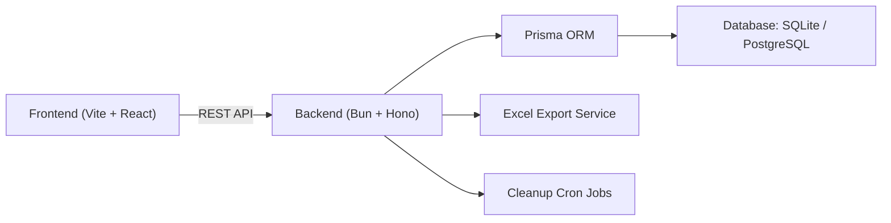
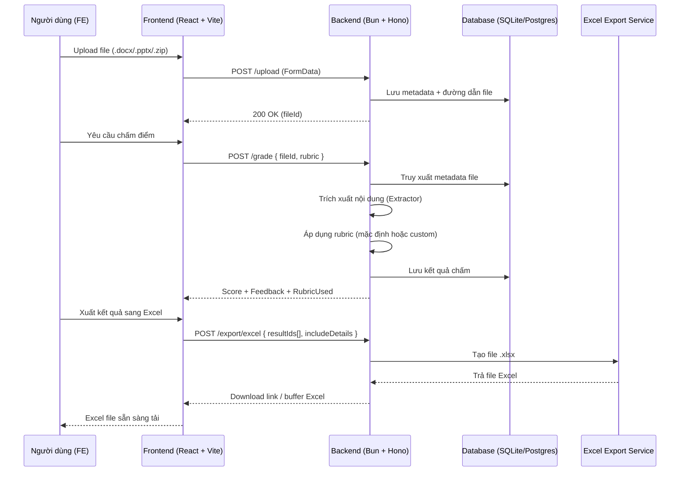

<p align="center">
  
  &nbsp;&nbsp;&nbsp;
  
  &nbsp;&nbsp;&nbsp;
  
  &nbsp;&nbsp;&nbsp;
  
  &nbsp;&nbsp;&nbsp;
  
  &nbsp;&nbsp;&nbsp;
  
  &nbsp;&nbsp;&nbsp;
  
</p>

<h1 align="center">
  Office Format Grader — Monorepo
</h1>

<p align="center"><strong>Web tool full-stack chấm điểm file Office (Word và PowerPoint)</strong></p>

---

## 🎯 Mục tiêu

Dự án **Office Format Grader** ra đời nhằm giải quyết bài toán **tự động chấm điểm và đánh giá chất lượng file Office (Word, PowerPoint)** dựa trên rubric. Thay vì phải chấm thủ công, công cụ này cho phép giảng viên hoặc người dùng nhanh chóng tải lên nhiều file, áp dụng rubric mặc định hoặc tùy chỉnh, và nhận lại điểm số cùng phản hồi chi tiết. Ngoài ra, kết quả có thể được **xuất ra Excel** để lưu trữ, phân tích và theo dõi tiến độ.  

Dự án được triển khai theo mô hình **monorepo**, trong đó backend và frontend được đặt trong cùng một workspace, giúp dễ dàng quản lý dependencies, đồng bộ script và phát triển full-stack liền mạch. Cấu trúc này không chỉ tối ưu cho phát triển cá nhân mà còn sẵn sàng để mở rộng và phát triển trong tương lai.

---

## 📂 Cấu trúc dự án

```text
office-format-grader/
├── apps/
│   ├── backend/     # Backend
│   └── frontend/    # Frontend
├── package.json     # Workspace config + root scripts
└── README.md        # README tổng quan
````

## 📊 Tổng quan hệ thống



---

## 🔄 Luồng Tổng Hợp: FE ↔ BE (Upload → Grade → Export)



---

## 🔑 Yêu cầu

* [Bun](https://bun.sh) ≥ 1.2
* Node.js ≥ 22.0 (dùng cho Prisma CLI và toolchain)

---

## 🚀 Quick Start

1. Cài đặt dependencies cho toàn bộ monorepo:

```bash
bun install
```

2. Tạo file `.env` từ `.env.example` cho cả hai app:

```bash
cp apps/backend/.env.example apps/backend/.env
cp apps/frontend/.env.example apps/frontend/.env
```

3. Chạy setup ban đầu (migrate DB + tạo user mặc định):

```bash
bun run setup:initial
```

4. Khởi chạy cả backend và frontend trong môi trường dev:

```bash
bun run dev
```

* Backend mặc định chạy ở: `http://localhost:3000`
* Frontend mặc định chạy ở: `http://localhost:5173`

---

## 📜 Scripts

### Root Scripts

* `bun install` — Cài dependencies cho cả hai app
* `bun run dev` — Chạy dev mode cho cả FE & BE song song
* `bun run build` — Build cả hai app production
* `bun run test` — Chạy test cho cả hai app
* `bun run clean` — Xóa artifacts build

### Setup Scripts

* `bun run setup:dependencies` — Cài deps cho cả hai app
* `bun run setup:initial` — DB migrate + tạo user mặc định
* `bun run setup:all` — Setup đầy đủ (deps + DB + users)

### Backend Scripts

* `bun run dev:backend` — Start backend dev
* `bun run build:backend` — Build backend
* `bun run start:backend` — Start backend prod
* `bun run test:backend` — Test backend

### Frontend Scripts

* `bun run dev:frontend` — Start frontend dev
* `bun run build:frontend` — Build frontend
* `bun run preview:frontend` — Preview build FE
* `bun run test:frontend` — Test FE
* `bun run lint:frontend` — Lint FE
* `bun run type-check:frontend` — Check TS FE

---

## 🌍 Environment Variables

Mỗi app có `.env` riêng:

* `apps/backend/.env` — Biến môi trường backend (DB, JWT, cleanup, ...)
* `apps/frontend/.env` — Biến môi trường frontend (API URL, debug, ...)

Tham khảo `.env.example` trong từng thư mục app.

---

## ⚡ Initial Setup

Lần đầu setup dự án:

```bash
# 1. Copy env
cp apps/backend/.env.example apps/backend/.env
cp apps/frontend/.env.example apps/frontend/.env

# 2. Setup DB + user
bun run setup:initial

# 3. Start dev mode
bun run dev
```
---

## 📘 Cảm nhận & Giá trị Học tập

Dự án **Office Format Grader** không chỉ là một sản phẩm thử nghiệm kỹ thuật mà còn mang lại nhiều ý nghĩa đối với quá trình học tập và phát triển cá nhân:

- **Hiểu về kiến trúc full-stack**: Từ thiết kế backend với Bun.js + Hono, JWT Auth, Prisma ORM đến xây dựng frontend bằng React + Vite, Mantine, Zustand ,TanStack Query/Router.  
- **Kinh nghiệm với monorepo**: Biết cách quản lý codebase nhiều ứng dụng trong cùng một workspace, đồng bộ script, môi trường, và quy trình CI/CD.  
- **Thực hành áp dụng best-practice**: Sử dụng Zod để validate dữ liệu, Zustand để quản lý state, lefthook cho pre-commit hook, testing với Vitest/Testing Library.  
- **Giá trị ứng dụng thực tiễn**: Giải quyết được một nhu cầu rõ ràng — chấm điểm file Word/PowerPoint tự động theo rubric, tiết kiệm công sức và tăng tính minh bạch.  
- **Tăng cường kỹ năng tự build webapp full-stack**: Trải nghiệm toàn bộ quy trình từ thiết kế database, xây dựng API, triển khai logic nghiệp vụ cho đến phát triển UI/UX hoàn chỉnh, tất cả đều do một mình tôi đảm nhiệm.  

👉 Đây là một **pet project quan trọng** giúp tôi vừa học vừa rèn kỹ năng, đồng thời tạo ra một nền tảng có thể mở rộng thành các ứng dụng phục vụ học tập và công việc trong tương lai.

