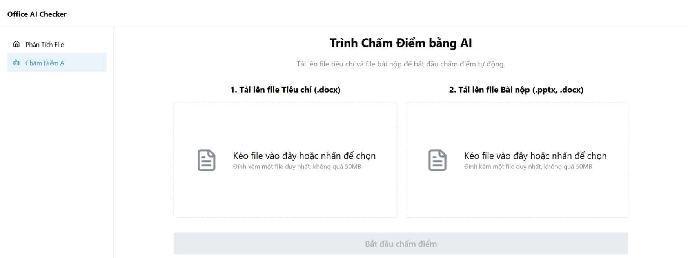
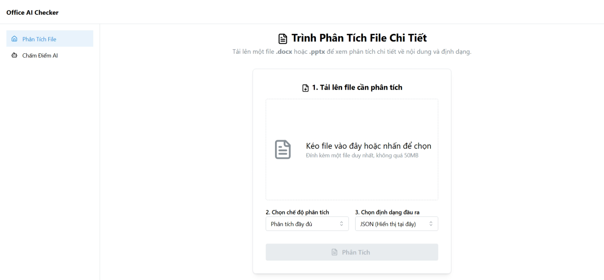
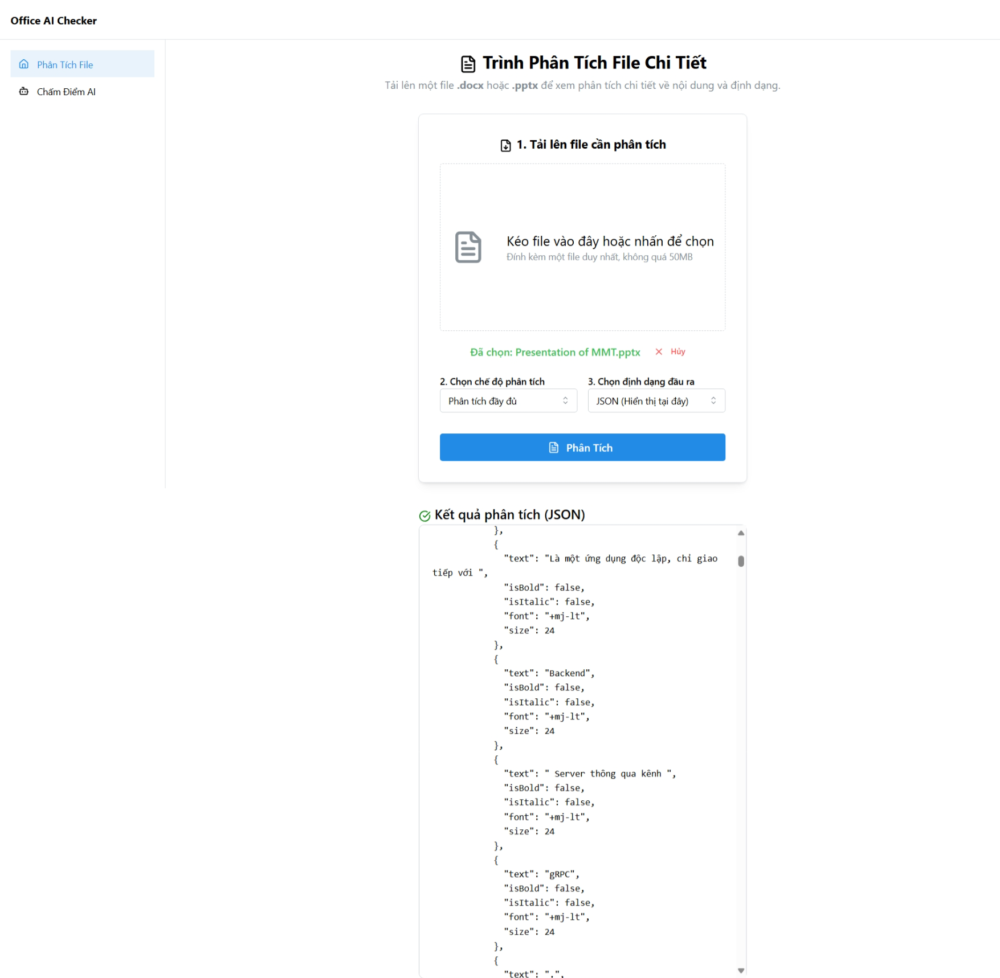
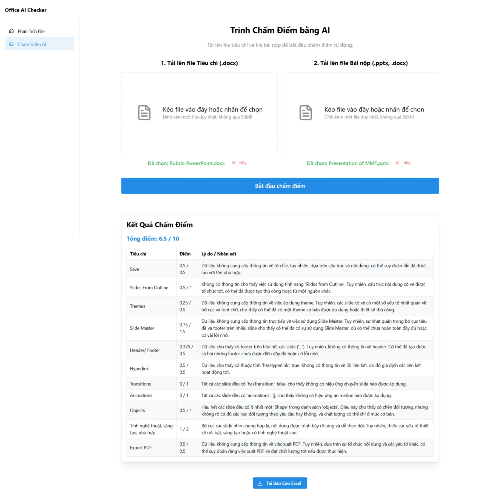

<p align="center">
  
  &nbsp;
  
  &nbsp;
  
  &nbsp;
  
  &nbsp;
  
</p>

<h1 align="center">
 Office Format Grader AI — Frontend
</h1>

<p align="center"><strong>Giao diện người dùng để phân tích và chấm điểm tài liệu Office với GenAI</strong></p>

---

## ✨ Giới Thiệu

Frontend cho dự án **chấm điểm tài liệu Microsoft Office** sử dụng GenAI (Gemini).  
Cho phép người dùng tải lên `.docx`, `.pptx` và nhận đánh giá tự động theo tiêu chí cho trước.

---

## 🖼️ UI

Một số ảnh chụp màn hình UI của **Office Format Grader AI**:

<table>
  <tr>
    <td align="center">
      <br>
      <i>Upload file và rubric và nhận kết quả chấm điểm từ AI.</i>
    </td>
    <td align="center">
      <br>
      <i>Kết quả phân tích định dạng file Word (.docx) trực quan.</i>
    </td>
  </tr>
</table>

<table>
  <tr>
    <td align="center">
      <br>
      <i>Phân tích chi tiết cấu trúc file PowerPoint (.pptx).</i>
    </td>
    <td align="center">
      <br>
      <i>Kết quả chấm điểm AI cho bài thuyết trình PowerPoint.</i>
    </td>
  </tr>
</table>

---

## ⚙️ Tech Stack

| Hạng mục           | Công cụ / Thư viện          | Lý do lựa chọn                                                  |
|--------------------|-----------------------------|------------------------------------------------------------------|
| **Framework**      | React (TypeScript) + Vite   | Hiệu suất cao, cộng đồng lớn, an toàn kiểu dữ liệu               |
| **Runtime**        | Bun.js                      | Tốc độ cài đặt và thực thi vượt trội                             |
| **Styling**        | Tailwind CSS v4 (tùy chọn)  | Styling hiện đại, dễ tuỳ biến                                    |
| **UI Components**  | Mantine UI                  | Bộ component đẹp, giàu tính năng, hỗ trợ Dropzone, Modal, Table  |
| **Routing**        | TanStack Router             | Type-safe, nested routing, tích hợp tốt                          |
| **Server State**   | TanStack Query              | Quản lý cache, gọi API tối ưu                                   |
| **Icons**          | lucide-react                | Gọn nhẹ, hiện đại, dễ dùng                                       |

---

## 🧱 Cấu Trúc Thư Mục

```bash
src/
├── components/         # Các UI component
├── pages/              # Route-based views
├── features/           # Modules lớn: upload, result, rubric...
├── hooks/              # Custom hooks (useUpload, useParse...)
├── services/           # API caller qua TanStack Query
├── utils/              # Hàm tiện ích
├── types/              # Kiểu dữ liệu dùng chung
└── main.tsx            # Entry point
````

---

## 🚀 Khởi Chạy Dev

### 1. Cài đặt

```bash
bun install
```

> Hoặc `npm install` nếu bạn fallback sang Node.js

### 2. Chạy dev server

```bash
bun run dev
```

Truy cập tại: [http://localhost:5173](http://localhost:5173)

---

## 🛠️ Build

```bash
bun run build
```

Output tại thư mục `dist/`

---

## 🔌 Cấu Hình Gọi API

Tạo file `.env`:

```env
VITE_API_URL=http://localhost:3000/api
```

---

## 📡 Tích Hợp Backend

Tự động gửi file `.docx` hoặc `.pptx` cùng rubric để API BE phân tích định dạng và gửi prompt cho GenAI.

```ts
// src/constants/api.ts
export const API_BASE_URL = import.meta.env.VITE_API_URL
```

---

<p align="center">
  <i>Built with ❤️ by React + Bun + Mantine + TanStack</i>
</p>

